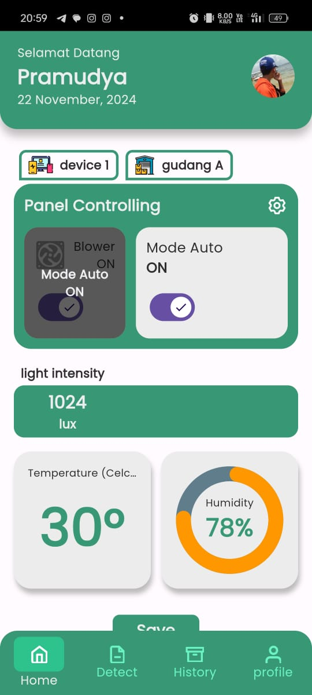
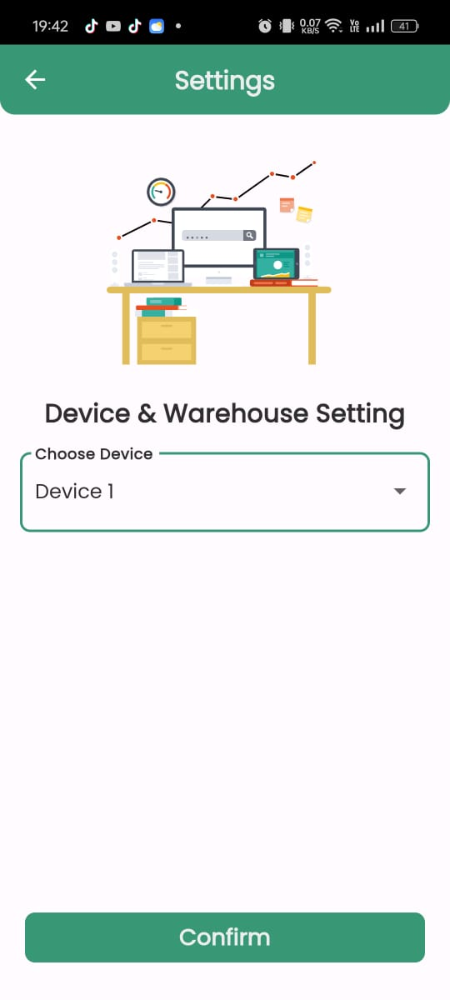
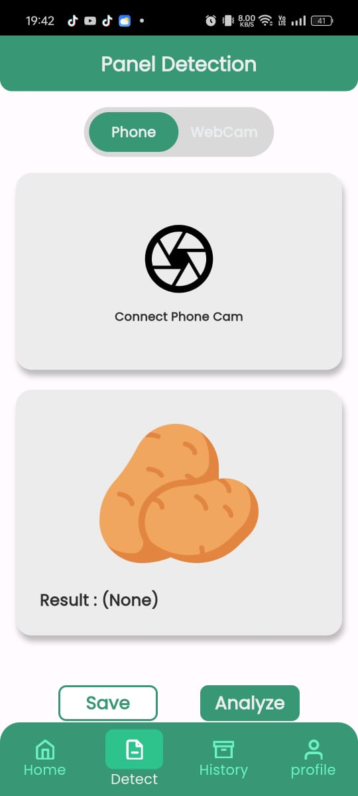
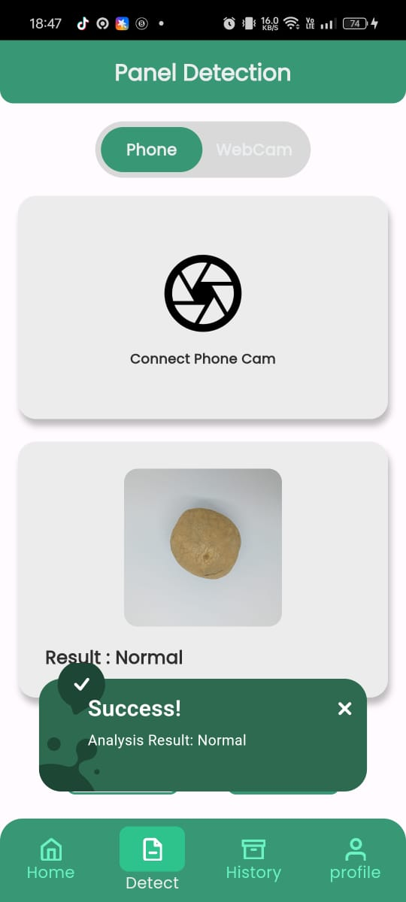
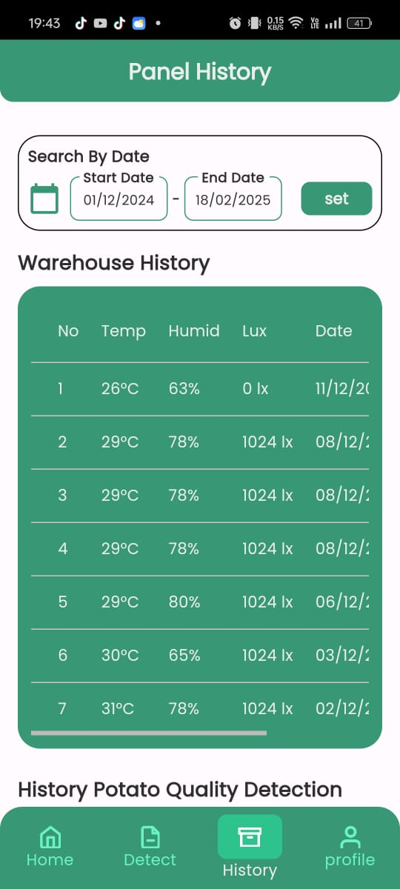
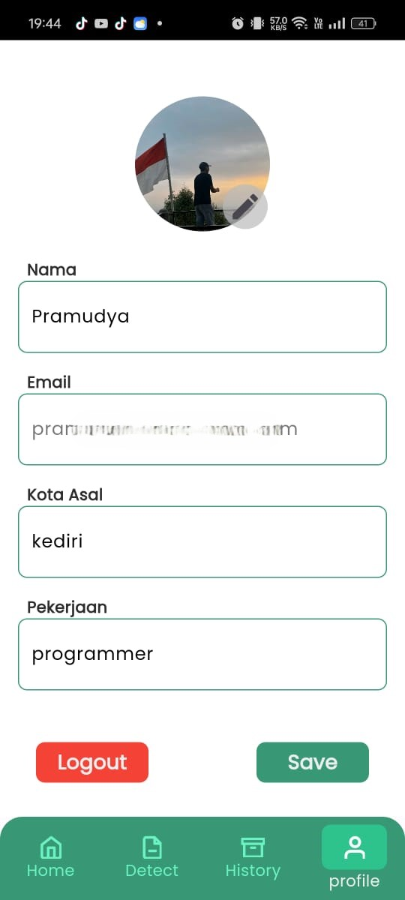

# Potato Base

Potato Base is an AI and IoT-powered system designed to detect potato defects and monitor storage conditions. This application utilizes computer vision and machine learning to determine whether a potato is defective or not based on color and texture feature extraction. Additionally, it integrates IoT sensors to track temperature, humidity, and luminance in storage facilities, ensuring optimal preservation conditions. By combining AI-driven image processing with real-time environmental monitoring, Potato Base enhances efficiency in agricultural storage and quality control, providing a smart solution for farmers and food industries.


## Screenshots

HomePage             |  Device Setting
:-------------------------:|:-------------------------:
  |  

Detect Page (1)             |  Detect Page (2)
:-------------------------:|:-------------------------:
  |  

History             |  Profile
:-------------------------:|:-------------------------:
  |  

## Tech Stack 🛠️

**Main App:** Flutter, Dart.  

**Database:** Firebase.

**REST-API:** Python, Flask.  

## Libraries Used 📦

- google_fonts
- syncfusion_flutter_charts
- image_picker
- firebase_storage
- lottie
- firebase_messaging

## Run Locally

1. Prepare and start module ESP32 board.

2. Run Python FLASK REST-API with KNN Model.

3. Clone the project

```bash
  git clone https://github.com/southampere28/potato_app.git
```

4. Go to the project directory

```bash
  cd my-project
```

5. Install dependencies

```bash
  flutter pub get
```

6. Run Application

```bash
  flutter run
```


## Features

- Real-time Device Warehouse Conidition Monitoring (Temperature, humidity, Light Intentity).
- Device Blower Control - Control the Blower for Manual or Auto Using Intuitive Button. 
- Potato Defect Detection - Detects whether a potato is normal or defective using color and texture analysis.
- History - Saves previous detection results and Warehouse Condition.
- Notification - Auto Send Message if warehouse condition is abnormal.

## Authors

- [@southampere28](https://www.github.com/southampere28) (Mobile Dev & AI Engineer)

## Team Project

- [@AfrizalAlka](https://github.com/AfrizalAlka) (IoT Enggineer & Mobile Dev)
- [@septianyoga22](https://github.com/septianyoga22) (IoT Device Assembler)
- [@daffaokta001](https://github.com/daffaokta001) (UI/UX Designer)
- [@ninikynrsh](https://github.com/ninikynrsh) (Documentator, UI/UX Designer)
- [@widyasari](https://github.com/widyasari) (Documentator, UI/UX Designer)